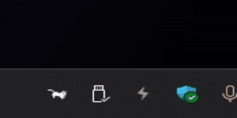

# PyCat

## Tags

- `Python` `Windows` `Mac`

## Demo



## Features

- Displays a system tray icon that changes based on CPU usage.
- Allows switching between different animal-themed icons (cats, horses, parrots) from the system tray menu.
- Supports launching applications (WeChat, QQ, Chrome) directly from the system tray menu.

## Requirements

- Windows、Mac operating system
- Python 3.10 or later

## Installation

1. **Clone or download the PyCat repository by following these steps:**
    - If you have Git installed, open a terminal and run the following command:
        ```bash
        git clone https://github.com/namashin/PyCat.git
        ```
    - If you prefer to download the repository as a ZIP file, you can click on the "Code" button on the GitHub
      repository page and select "Download ZIP". After downloading, extract the contents to a directory of your choice.

2. **Install Python if you haven't already.** You can download Python from
   the [official website](https://www.python.org/downloads/).

3. **Install the required Python packages using pip.** Navigate to the PyCat directory in your terminal and run the
   following command:
    ```bash
    pip install -r requirements.txt
    ```

4. **Run the PyCat application** by executing the following command in the terminal:
    ```bash
    python py_cat.py
    ```

If everything is set up correctly, the PyCat application should start, and you'll see its icon in the system tray.

5. **If you want to make exe**

```bash
pyinstaller py_cat.py utils.py --clean --name=py_cat.exe --onefile --noconsole --icon=res/app.ico
```

## Usage

1. After starting PyCat, you'll see its icon in the system tray.
2. Right-click on the icon to access the menu:
    - Select different animal icons (cats, horses, parrots) to change the icon theme.
    - Launch WeChat, QQ, or Chrome directly from the menu.
    - Exit the PyCat application.

## Configuration

- Application settings are stored in `ini/settings.ini`.
- You can modify the configuration file to add new applications or customize the behavior of PyCat.

## Development

- Contributions are welcome! Feel free to submit bug reports, feature requests, or pull requests.
